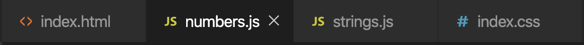

# Hello-JavaScript
Part 1 of my <i>Hello, \<Programming Language\>!</i> series.

The <i>Hello, \<Programming Language\>!</i> series is a project to help me familiarise myself with a variety of different programming languages before starting my Master's Thesis over the summer. 

<h1> Hello, JavaScript!</h1>

<ul>
  <li>Numbers</li>
  <li>Strings</li>
</ul>

